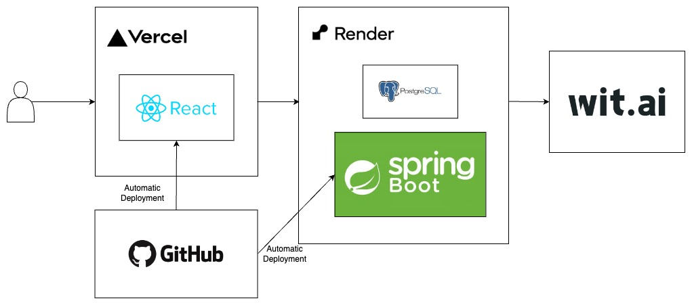

# Voice to Text API

The **Voice to Text API** provides the back-end functionality for the Voice to Text application, enabling users to record voice and transcribe it. It is designed to work seamlessly with the [Voice to Text Client](https://github.com/goothrough/voice-to-text-client).

## Features

- RESTful API for transcribing voice data with wav file format
- Integration with Wit.ai API for transcribe voice data

## Architecture Diagram

The following diagram illustrates the architecture of the Voice to Text application:

## Technologies Used

The development and deployment of the Voice to Text API involve the following skills and technologies:

- **Language**: Java
- **Framework**: Spring Boot, JPA/Hibernate
- **Database**: PostgreSQL
- **Cloud Services**: Render
- **API Integration**: [Wit.ai](https://wit.ai/)
- **Build Tools**: Maven
- **Version Control**: GitHub
- **Deployment**: Automatic deployment to Render

## How it works

See [Voice to Text Client](https://github.com/goothrough/voice-to-text-client).